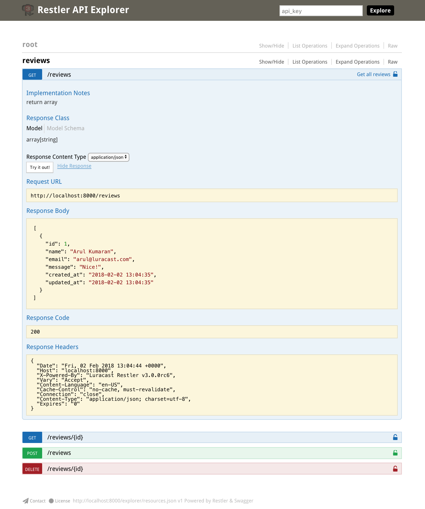

Restler Application with Eloquent
=================================

Api server boilerplate with database support for [Luracast Restler](https://github.com/Luracast/Restler)

Restler is an "API First Micro Framework" that offers better web api by design.

Every branch in this git repository contains different application templates to suit your specific needs.

Eloquent App provides laravel 4.2 structure and laravel 5.2 database support for your restler application development


Installation
------------

Make sure PHP 5.5.9 or above is available on your server

[Composer](http://getcomposer.org/) is used to manage the dependencies. If you don't already
have composer installed, we recommend installing it globally

### Install Composer

Instructions to install composer globally are available in [getcomposer.org](https://getcomposer.org/doc/00-intro.md#system-requirements)

### Install Eloquent Restler Application

You can run the following command on your terminal window to install the app

    composer create-project restler/application=dev-eloquent {app_name}

Replace `{app_name}` with the name of your application.

It will create a new folder and place all the needed files to get started.


What's in it?
-------------

Eloquent Application Template offers lluminate Database support along with Migration, Seeding and Artisan.

> **Note:-** This template is built using [Laravel Database](https://github.com/Luracast/Laravel-Database)

[Laravel](https://github.com/laravel/laravel) is a web application framework with expressive, elegant syntax.
We extracted the database functionality from it and made it available for restler

The [Illuminate Database](https://github.com/illuminate/database) component is a full database toolkit for PHP,
providing an expressive query builder, ActiveRecord style ORM, and schema builder. It currently supports MySQL,
Postgres, SQL Server, and SQLite.

We combined it with Illuminate FileSystem and Illuminate Console to make
Artisan work with database related commands.

There is a sample API Class called  `Home` in `app/controllers` directory that has the following success message
for the root of the API.


```json
{
    "success": {
        "code": 200,
        "message": "Restler is up and running!"
    }
}

```

On your development machine, you can run the development server by
running the `php artisan serve` on the project root. This will run the php development server at
port 8000 on localhost by default. If you need to change that you may use the command line
options as shown below

    php artisan serve --port=8888 -host=testserver.dev

This project also comes with swagger ui for testing and documenting the api. You can access that
using the following url

http://localhost:8000/explorer


#### How it works?

`index.php` in the public folder includes the `autoload.php` in `bootstrap` folder which internally
uses composer autoloader. This enables lazy loading for all db related classes. Only when you call
one of the DB related class, database engine is initialized.

#### More Documentation

Refer to all database related sections on [Laravel 5.2 website](http://laravel.com/docs/5.2). 
But folder structure of the application is like [Laravel 4.2](http://laravel.com/docs/4.2)


#### What to do next?

Open the terminal and change directory to the root of the application. Assuming your app is named `my_api`

    cd my_api

First you need to edit the database configuration file (`app/config/database.php`). Based on your database choice (sqlite, mysql, postgres, etc) update the default key and  update information under connections.

For example, if you choose `mysql` and database name is `my_api`, username is `root` and password is `test`,  that configuration will look like the following

```php
<?php

return array(
    'default' => 'mysql',
    'connections' => array(
        'mysql' => array(
            'driver'    => 'mysql',
            'host'      => '127.0.0.1',
            'database'  => 'my_api',
            'username'  => 'root',
            'password'  => 'test',
            'charset'   => 'utf8',
            'collation' => 'utf8_unicode_ci',
            'prefix'    => '',
        ),
    ),
);
```

> **Note:-** I have removed irrelevant portions from the configuration file for ease of reading, you should keep them in your file

Check the database connection with the following command.

    php artisan migrate:install

    Migration table created successfully.

Next you will create a migration file for creating the new table, how about creating an API for writing reviews?

    php artisan make:migration --create=reviews create_reviews_table

    Created Migration: 2016_05_15_150447_create_reviews_table

Edit the `app/database/migrations/2016_05_15_150447_create_reviews_table` file to have the following content

>**Note:-** date and time of calling the command will change the file name accordingly

```php
<?php

use Illuminate\Database\Schema\Blueprint;
use Illuminate\Database\Migrations\Migration;

class CreateReviewsTable extends Migration
{
    /**
     * Run the migrations.
     *
     * @return void
     */
    public function up()
    {
        Schema::create('reviews', function (Blueprint $table) {
          $table->increments('id');
          $table->string('name');
          $table->string('email');
          $table->text('message');
          $table->timestamps();
        });
    }

    /**
     * Reverse the migrations.
     *
     * @return void
     */
    public function down()
    {
        Schema::drop('reviews');
    }
}

```

Here we are creating reviews table with the name, email, and message columns. Next we will run the migration tool so that this table will actually be created.

```
php artisan migrate

Migrated: 2016_05_15_150447_create_reviews_table
```

Now we can generate a model class with the following command

```
php artisan make:model Review

Model created successfully.
```

Here we specify the model name as the singular version of the table name. `app/models/Review.php`  is generated based on the table structure of reviews table

The comments at the top of the file are used by restler to understand what properties are exposed by the model.

```php
/**
 * Class Review
 *
 * @property-read  int    $id
 * @property       string $name
 * @property       string $email
 * @property       string $message
 * @property-read  string $created_at {@type date}
 * @property-read  string $updated_at {@type date}
 *
 */
 ```

Next let us create the API class `app/controllers/Reviews.php` with the following content

```php
<?php

use Luracast\Restler\RestException;

class Reviews {
    /**
    * Get all reviews
    *
    * return array {@type Review}
    */
    public function index(){
        return Review::all();
    }

    public function get($id){
        if(!$review = Review::find($id)){
            throw new RestException(404, 'review not found');
        }
        return $review;
    }

    public function post(Review $review){
        $review->save();
        return $review;
    }

    public function delete($id){
        if(!$review = Review::find($id)){
            throw new RestException(404, 'review not found');
        }
        $review->delete();
        return ['success'=>true];
    }

}
```

After that edit the `public/index.php` to add the following line to include the new API.

```php
$r->addApiClass('Reviews');
```

That's all, you can start the web server with

    php artisan serve

    Web app development server started on http://localhost:8000

Point your web browser to http://localhost:8000/explorer/ and explore!

[](documentation/explorer.png)

#### Production Mode

Make sure all the folders inside `app/storage` have write permission for the application to write the needed files for caching

Create `.env` by cloning `.env.example`

    cp .env.example .env

Update the database configuration inside the `.env` file

Now Restler should be running in production mode and laravel related components are running under production environment!

> **Note:-** when running in production mode restler won't detect addition or removal of an api. You need to manually delete the cache files under `app/storage/cache`
